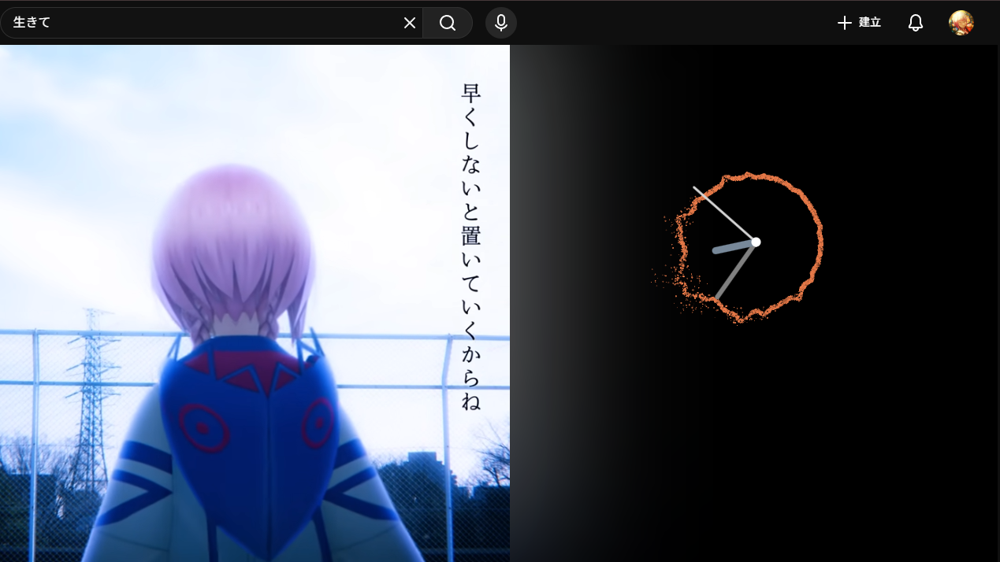

## Virtual Music Clock (Swarm Edition)

A desktop-grade audio visualization utility built with Electron and Next.js, featuring a high-performance WebGL2 GPGPU particle system. This "Swarm Edition" transforms the traditional spectrum ring into a living ecosystem of thousands of particles that react, shatter, and recombine to the beat of your music.

## Preview



## Why I Made This

This project is a complete architectural restructure of my original music clock built 5 years ago with p5.js. By moving away from simple 2D Canvas lines to a GPGPU (General-Purpose Computing on Graphics Processing Units) approach, we can now simulate over 10,000 individual "swarm" particles at a locked 60FPS, each with its own momentum, friction, and "personality".

## Features

- WebGL2 GPGPU Particle Engine: Uses Ping-Pong Framebuffer techniques to store and update particle positions and velocities directly on the GPU textures.

- Swarm Ecology (Freedom vs. Core):
    - Particles are differentiated by a unique random weight (pRand).

    - Core Particles: Tightly bound to the clock's circular spectrum.

    - Freedom Particles: React to Curl Noise and "swarm" around the perimeter, creating a nebula-like trail.

- Spectrum-Driven Deformation: The swarm's return target is dynamically recalculated based on 64 frequency bands, creating a fluid, organic wave that mirrors the audio input.

- Dynamic HSL Color Mapping: Maps real-time Bass energy to the HSL color space. The swarm shifts from a calm "Miku Green" to vibrant cyan and intense blues as the low-end frequency intensifies.

- Dual-Layer Rendering:
    - WebGL Layer: Handles the complex physical simulation and additive glow of the swarm particles.

    - 2D Canvas Layer: Renders high-DPI sharp clock hands for clear time readability.

## Tech Stack

- Framework: Electron + Next.js (App Router)

- Communication: Local WebSocket (ws) for cross-window data broadcasting

- Audio Engine: Native Web Audio API for FFT Analysis

- Graphics: WebGL2 for GPGPU simulation + HTML5 Canvas 2D for the UI

## Install

```
# Install dependencies
npm install

# Develop mode: start the full environment
npm run start:all

# Build mode: production executable (.exe / .app)
npm run build
```

## Run

Currently the project needs to enable Stereo Mix to get the speaker's audio.

[How to enable Stereo Mix in Win10](https://www.youtube.com/watch?v=Bd3moKLV5sE)

You can change the setting to fix the clock also


